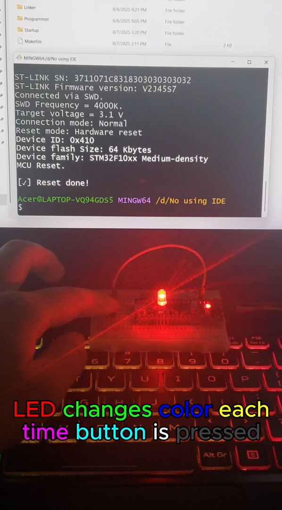
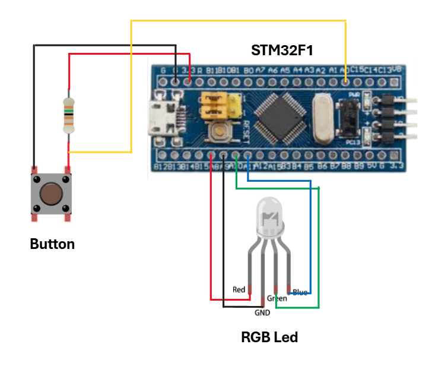
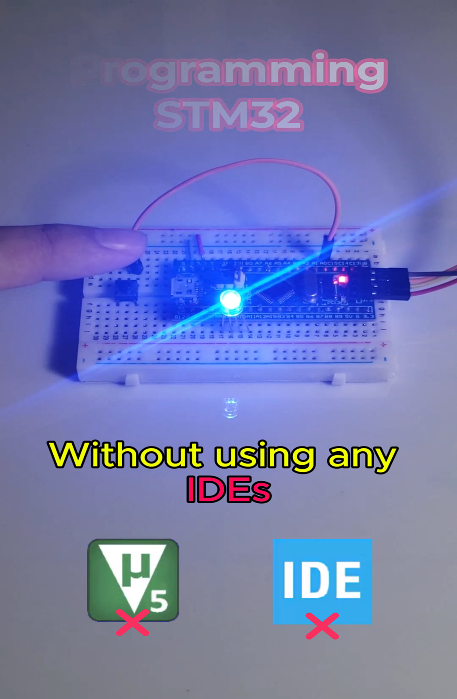

# STM32 | 🎛️✨ PROGRAMMING CHIP WITHOUT USING ANY IDEs

Author: **Kael Shelby** (VTN)

## 📖 1. Introduction  
This project demonstrates how to perform **bare-metal programming** (without IDEs, without HAL/LL) on the STM32F103C8T6.  

Tools used:  
- `arm-none-eabi-gcc` for compilation  
- `ST-LINK_CLI` for flashing the firmware  

<div align="center">
  
</div>

The program cycles through LED colors when the button is pressed:

🔴 Red → 🟢 Green → 🔵 Blue → 🟡 Yellow → 🟣 Purple → 🔵 Cyan → ⚪ White → ⚫ Off → (repeat).  

---

## 🛠️ 2. Hardware Requirements
To build this project, you will need:
- STM32F103C8T6 (Blue Pill)
- Push button + resistor
- RGB LED

---

## 🔌 3. Circuit Diagram  


### Pin Mapping
| Device         | Module Pin | STM32F103C8T6 | Description                          |
|----------------|------------|---------------|--------------------------------------|
| **Push Button**| VCC        | 3.3V          | Power supply                         |
|                | GND        | GND           | Common ground                        |
|                | Signal     | PA0           | Button signal (with pull-up)         |
| **RGB LED**    | Cathode    | PA10          | Common cathode                       |
|                | R          | PA8           | Controls **Red** LED                 |
|                | G          | PA10          | Controls **Green** LED               |
|                | B          | PA11          | Controls **Blue** LED                |

---

## 🎥 4. Demo and Results
👉 [Watch the demo video](https://www.tiktok.com/@kshelbyiot/video/7538661106458381576?is_from_webapp=1&sender_device=pc&web_id=7500959777037518344)

<p align="center">
  <a href="https://www.tiktok.com/@kshelbyiot/video/7538661106458381576?is_from_webapp=1&sender_device=pc&web_id=7500959777037518344">
    
  </a>
</p>

## 🧑‍💻 5.  Build & Flash  

**1. Clone the project from GitHub**  
   ```bash
   git clone <url>
   ```

**2. Connect the ST-LINK to your PC**
**3. Open a terminal**
- Supported: Git Bash, MSYS2/MinGW64, or Linux terminal.
- Navigate to the project directory.


**4. Run Makefile commands**
### 🔨 Build firmware
```sh
make
```
👉 Compiles the source code → generates .elf, .hex, and .bin.

### 🧹 Erase chip
```sh
make erase
```
👉 Erases the entire flash memory on the STM32.

### 📤 Flash program
```sh
make load
```
👉 Uploads main.hex to address 0x08000000 on STM32.

### 🔄 Reset chip
```sh
make reset
```
👉 Resets the MCU to start running the newly flashed firmware.

### 🗑️ Clean project
```sh
make clean
```
👉 Removes all build artifacts (.o, .elf, .hex, .bin).
